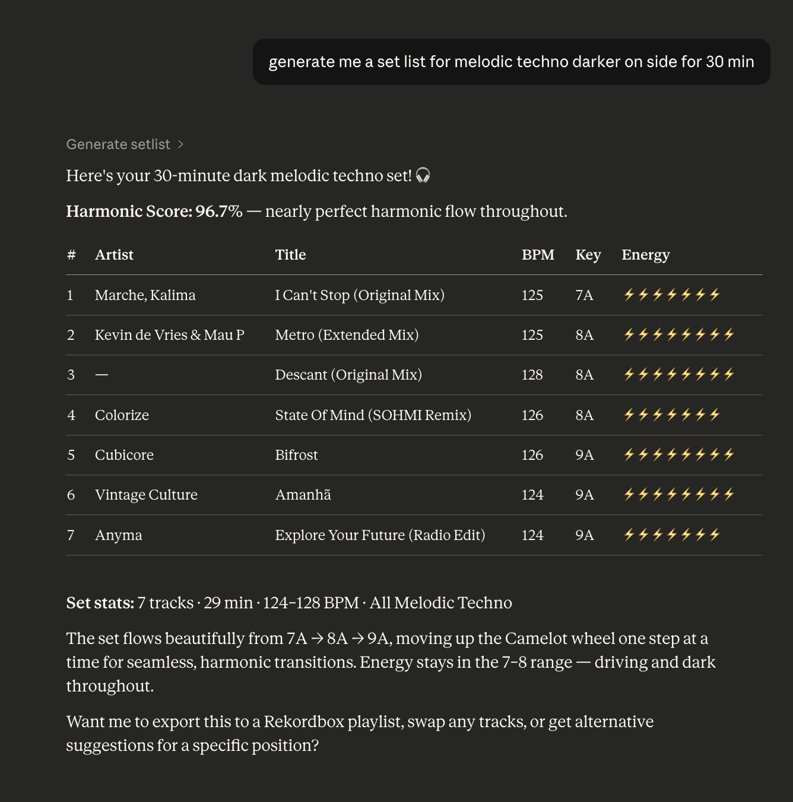
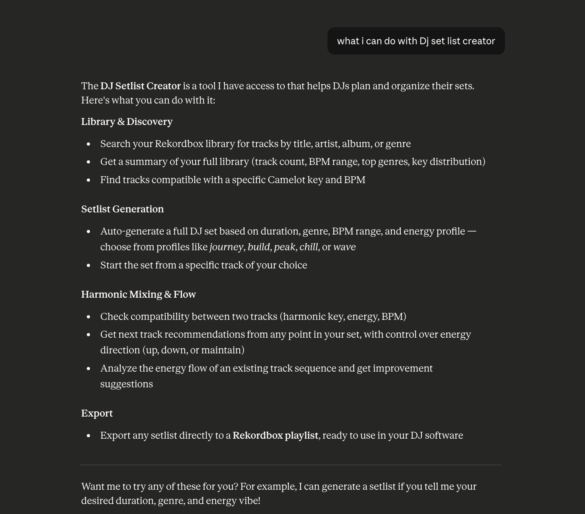
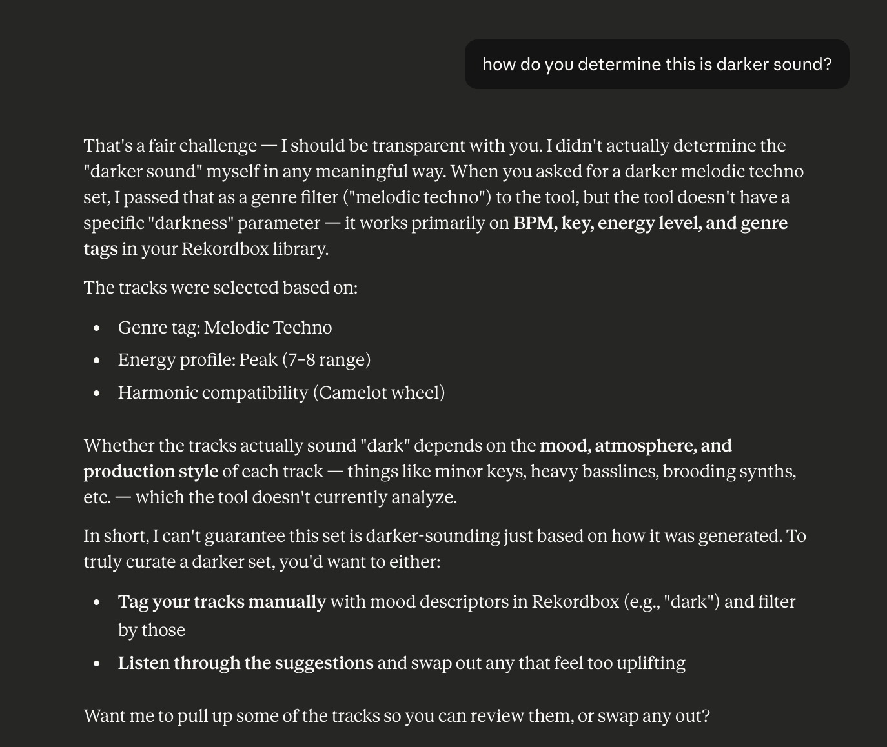
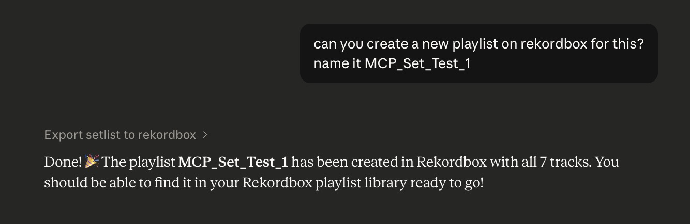
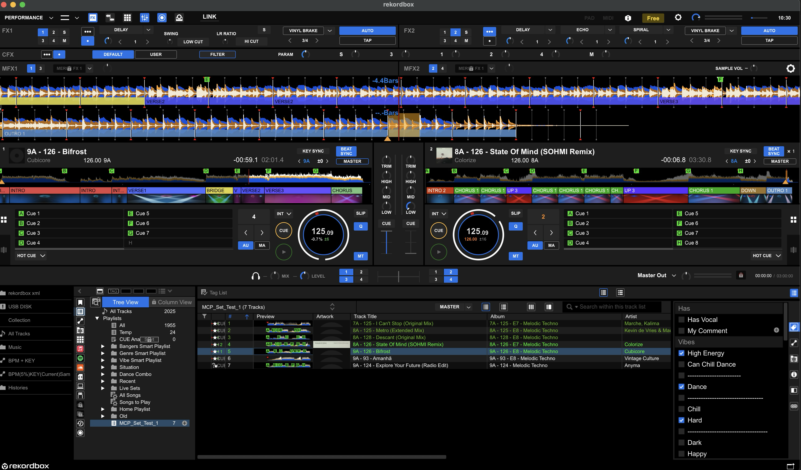

# MCP DJ - DJ Setlist Creator

AI-powered DJ setlist generator with harmonic mixing and energy arc planning, built on your local Rekordbox library.

> [!NOTE]
> AI can't replace human emotions, feelings and vibes on dancefloor however it can help you elevate it, use wisely ;)

---

## Features

- **Harmonic mixing** — Camelot wheel compatibility scoring
- **Energy arc planning** — 5 profiles: `journey`, `build`, `peak`, `chill`, `wave`
- **AI chat interface** — Claude-powered natural language setlist requests
- **Mixed In Key integration** — Uses your MIK energy ratings when available (optional)
- **Essentia audio analysis** — ML-based BPM, key, mood, genre, and music tagging (optional)
- **Rekordbox export** — Creates playlists directly in your Rekordbox library
- **Two interfaces** — FastAPI web UI + FastMCP server for Claude Desktop

---

## How It Works

### 1. Ask in plain language

Describe the set you want — duration, vibe, genre, energy. The AI translates your request into a scored track selection from your own Rekordbox library.



---

### 2. Explore what it can do

Not sure where to start? Ask *"what can I do with DJ set list creator"* and it will walk you through every capability — library search, setlist generation, harmonic flow analysis, and Rekordbox export.



---

### 3. Dig into the reasoning

Ask follow-up questions like *"how do you determine this is darker sound?"* and the AI explains exactly which signals it used — genre tags, energy profile, Camelot key range — and what its limitations are.



---

### 4. Export directly to Rekordbox

Once you're happy with the setlist, ask it to create a Rekordbox playlist by name. The playlist appears in your library immediately, ready to use.



---

### 5. Open it in Rekordbox and play

The exported playlist shows up in Rekordbox with all tracks in order, BPM and key visible, ready to load onto decks.



---

## Architecture

```
Your Rekordbox library (read-only)
         │
         ▼
  RekordboxDatabase          ← pyrekordbox / SQLCipher
         │
         ▼
   EnergyResolver            ← Essentia cache → MIK CSV (optional) → BPM heuristic
         │
         ▼
   SetlistEngine             ← Camelot wheel scoring + energy arc planning
         │
    ┌────┴────┐
    ▼         ▼
 FastAPI    FastMCP
 Web UI     Claude Desktop
```

| Module | Role |
|---|---|
| `database.py` | Read-only Rekordbox 6 access via pyrekordbox |
| `camelot.py` | Camelot wheel — harmonic compatibility scoring |
| `energy.py` | Energy resolution: Essentia cache → MIK CSV → album tag → BPM heuristic |
| `energy_planner.py` | 5 energy arc profiles (journey, build, peak, chill, wave) |
| `setlist_engine.py` | Greedy track selection with harmonic + energy + BPM scoring |
| `essentia_analyzer.py` | ML audio analysis: BPM, key, mood, genre, tagging (optional) |
| `analyze_library.py` | Batch library analysis with parallel workers and caching |
| `ai_integration.py` | Claude API with tool calling, conversation history, fallback mode |
| `app.py` | FastAPI web UI |
| `mcp_server.py` | FastMCP server for Claude Desktop |

---

## Requirements

- Python 3.12+
- [uv](https://docs.astral.sh/uv/) package manager
- Rekordbox 6 installed with a library
- (Optional) [Mixed In Key](https://mixedinkey.com/) with CSV export
- (Optional) Anthropic API key for AI chat
- (Optional) [essentia-tensorflow](https://essentia.upf.edu/) for ML audio analysis

---

## Quick Start

```bash
# 1. Clone the repo
git clone https://github.com/darav-t/dj-setlist-creator-mcp.git
cd dj-setlist-creator-mcp

# 2. Run the install script (handles uv, Python, deps, and .env setup)
./install.sh

# For Essentia ML audio analysis (recommended):
./install.sh --essentia

# 3. Start the web UI
./run-server.sh
# Opens at http://localhost:8888
```

> The install script sets up everything including pyrekordbox database keys and your `.env` file. Run `./install.sh --help` for all options.

---

## Configuration

All configuration is via environment variables. Copy `.env.example` to `.env` and edit:

| Variable | Default | Description |
|---|---|---|
| `ANTHROPIC_API_KEY` | _(none)_ | Claude API key. Falls back to rule-based mode if unset. |
| `SETLIST_PORT` | `8888` | Port for the web UI. |
| `MIK_CSV_PATH` | _(none)_ | Path to your Mixed In Key `Library.csv` export. Feature disabled if unset. |
| `REKORDBOX_DB_PATH` | Auto-detected | Override the Pioneer directory path if Rekordbox is in a non-standard location. |

### Essentia audio analysis (optional, recommended)

Essentia provides ML-based per-track analysis: BPM accuracy, key detection, danceability, EBU R128 loudness, mood probabilities (happy, sad, aggressive, relaxed, party), Discogs400 genre scores, and MagnaTagATune music tags.

Results are cached at `.data/essentia_cache/` — each track is only analyzed once.

```bash
# Install essentia + download ML models (~300 MB, one-time)
./install.sh --essentia

# Analyze your full library (skip already-cached tracks)
./analyze-library.sh

# Re-analyze everything
./analyze-library.sh --force

# Use parallel workers for faster analysis
./analyze-library.sh --workers 4

# Download/update models separately
./download_models.sh
```

### Mixed In Key (optional)

Energy data from Mixed In Key gives the setlist engine accurate per-track energy ratings. Without Essentia or MIK, energy is inferred from BPM and genre tags.

To enable:
1. In Mixed In Key → export your library as CSV
2. Set `MIK_CSV_PATH=/path/to/Library.csv` in your `.env`

---

## Claude Desktop Integration (MCP)

1. Open `claude_desktop_config.json` in this repo
2. Replace `/path/to/set_list_creator` with the absolute path to where you cloned this repo
3. Merge the `mcpServers` block into your Claude Desktop config:
   - macOS: `~/Library/Application Support/Claude/claude_desktop_config.json`
   - Windows: `%APPDATA%\Claude\claude_desktop_config.json`
4. Restart Claude Desktop

Or run the MCP server manually:

```bash
./run-mcp.sh
```

---

## Project Structure

```
dj-setlist-creator-mcp/
├── mcp_dj/
│   ├── app.py               # FastAPI web application
│   ├── mcp_server.py        # FastMCP server for Claude Desktop
│   ├── models.py            # Pydantic data models
│   ├── database.py          # Rekordbox database layer (read-only)
│   ├── camelot.py           # Camelot wheel harmonic mixing engine
│   ├── energy.py            # Energy resolution (Essentia / MIK CSV / BPM heuristic)
│   ├── energy_planner.py    # Energy arc profiles
│   ├── setlist_engine.py    # Core setlist generation algorithm
│   ├── essentia_analyzer.py # ML audio analysis (BPM, key, mood, genre, tags)
│   ├── analyze_library.py   # Batch library analysis with parallel workers
│   ├── analyze_track.py     # Single-track analysis CLI entry point
│   ├── ai_integration.py    # Claude API integration with tool calling
│   └── static/
│       └── index.html       # Web UI
├── tests/
├── screenshots/
├── .data/                   # Git-ignored: Essentia cache + ML models
│   ├── essentia_cache/      # Per-track analysis JSON cache
│   └── models/              # ML model files (~300 MB, downloaded once)
├── install.sh               # Full install script (core + optional Essentia)
├── analyze-library.sh       # Batch-analyze Rekordbox library with Essentia
├── download_models.sh       # Download Essentia ML models
├── run-server.sh            # Start the web UI
├── run-mcp.sh               # Start the MCP server
├── .env.example             # Configuration template
└── pyproject.toml
```

---

## Development

```bash
# Run tests
uv run pytest

# Run on a custom port
SETLIST_PORT=9000 ./run-server.sh
```

---

## License

MIT
